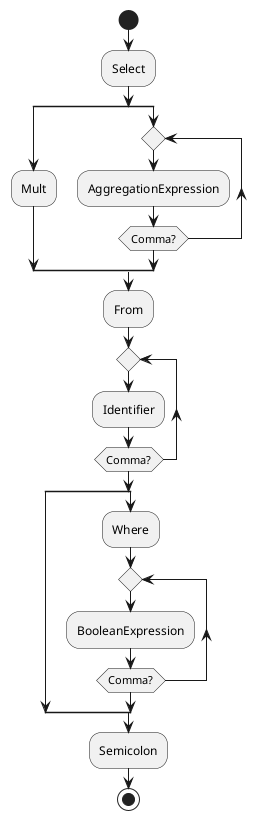

# Query language compiler notes

## Grammar primitives

- Select
- Insert
- Delete
- From
- Into
- Values
- Where
- Comma
- Semicolon
- Dot
- Identifier
- Value
  - Boolean
  - String
  - Integer
  - Float
- Parenthesis
  - Opening
  - Closing
- LogicalOperator
  - Or
  - And
  - Not
- ComparisonOperator
  - ==
  - !=
  - <
  - <=
  - \>
  - \>=
- NumericalOperator
  - Add
  - Sub
  - Mult
  - Div

## Grammar rules (sentences)

### Select statement

