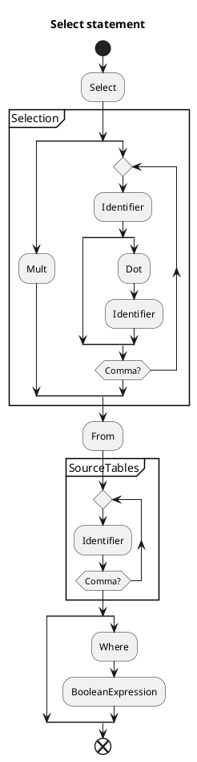
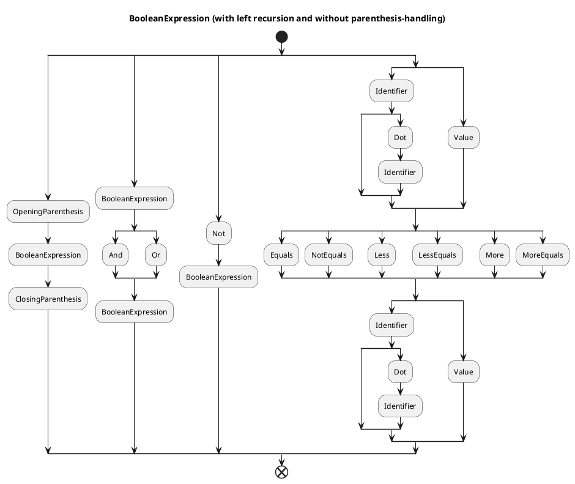
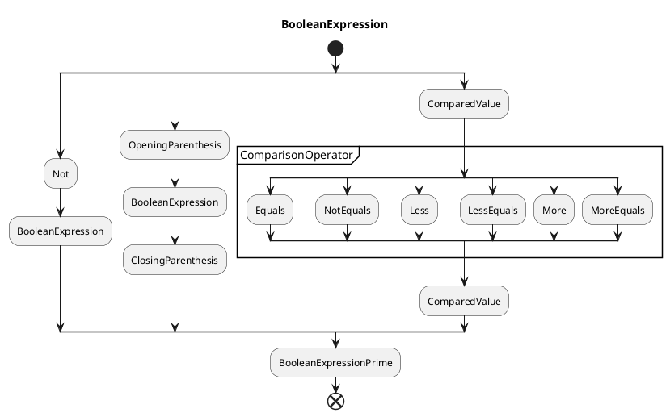
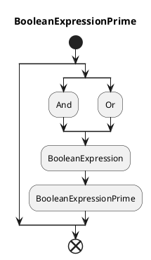

# Query language compiler notes

## Grammar primitives

- Select
- Insert
- Delete
- From
- Into
- Values
- Where
- Comma
- Semicolon
- Dot
- Identifier
- Value
  - Boolean
  - String
  - Integer
  - Float
- Parenthesis
  - Opening
  - Closing
- LogicalOperator
  - Or
  - And
  - Not
- ComparisonOperator
  - ==
  - !=
  - <
  - <=
  - \>
  - \>=
- NumericalOperator
  - Add
  - Sub
  - Mult
  - Div

## Grammar rules 
(sentences)

```plantuml
title DML query
start
split
:SelectStatement;
split again
:InsertStatement;
split again
:DeleteStatement;
split again
:UpdateStatement;
end split
:DMLQueryPrime;
end
```

```plantuml
title DML Query Prime
start
split
split again
:Semicolon;
:DMLQuery;
:DMLQueryPrime;
end split
end
```

### Select statement



### Boolean expression



#### After removing left recursion and adding parenthesis-handling





---
#### Compared value

```plantuml
title ComparedValue
start
split
:Identifier;
split
:Dot;
:Identifier;
split again
end split
split again
:Value;
split again
:OpeningParenthesis;
:ComparedValue;
:ClosingParenthesis;
end split
:ComparedValuePrime;
end
```

```plantuml
title ComparedValuePrime
start
split
split again
:NumericalOperator;
:ComparedValue;
:ComparedValuePrime;
end split
end
```

### Insert statement

```plantuml
title Insert statement
start
:Insert;
:Into;
:Identifier;
:OpeningParenthesis;
repeat
:Identifier;
repeat while (Comma?)
:ClosingParenthesis;
:Values;
:OpeningParenthesis;
repeat
:InsertionValue;
repeat while (Comma?)
:ClosingParenthesis;
end
```

#### Insertion value

```plantuml
title Insertion value
start
split
:Value;
split again
:NumericalExpression;
end split
end
```

#### Numerical expression

```plantuml
title Numerical expression
start
split
:Value;
split again
:OpeningParenthesis;
:NumericalExpression;
:ClosingParenthesis;
split again
:Identifier;
split
split again
:Dot;
:Identifier;
end split
end split
:NumericalExpressionPrime;
end
```

```plantuml
title Numerical expression prime
start
split
split again
:NumericalOperator;
:NumericalExpression;
:NumericalExpressionPrime;
end split
end
```
